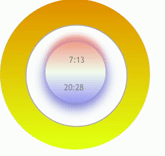

# open-weather-lib

> Made with create-react-library

[](https://www.npmjs.com/package/open-weather-lib) [](https://standardjs.com)

## Install

```bash
npm install --save open-weather-lib
```

## Usage

```jsx
import React from 'react'

import { OpenWeather } from 'open-weather-lib'
import './node_modules/open-weather-lib/dist/index.css';

const WEATHER_DATA = {
  appId:'YOUR_OPEN_WEATHER_API_ID',
  units:'metric/impercial',
  type:'current',
  "location":{
  	"city":"Guadalajara",
  	"country":"Mx"
  },
  "cord":{
  	"lat":"20.6565116",
  	"lon":"-103.4128702"
  },
};

const App = () => {
  return <OpenWeather 
  			weatherData={WEATHER_DATA}
  		/>
}

export default App
```
## Notes:&nbsp;
[link to OpenWeather](https://openweathermap.org/api)&nbsp;




By now is just the current weather, we will work for have more options

## License

MIT © [](https://github.com/)
